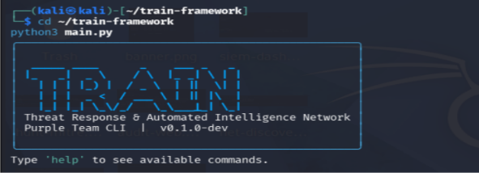
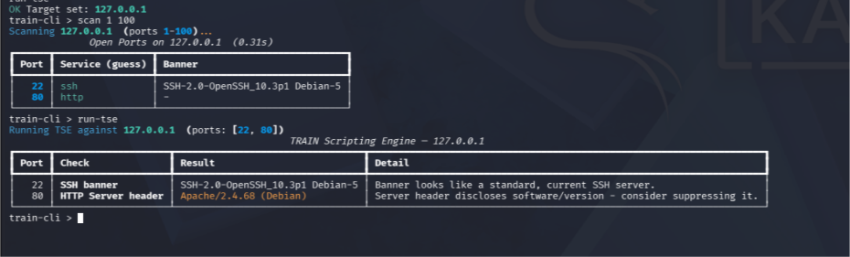
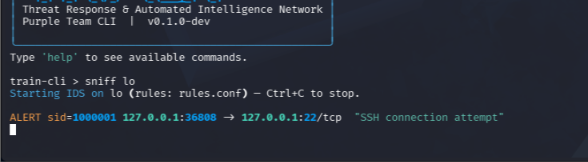
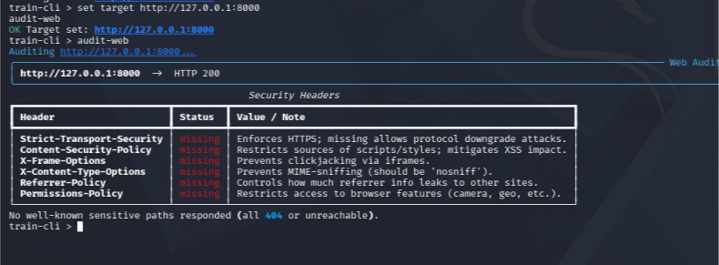
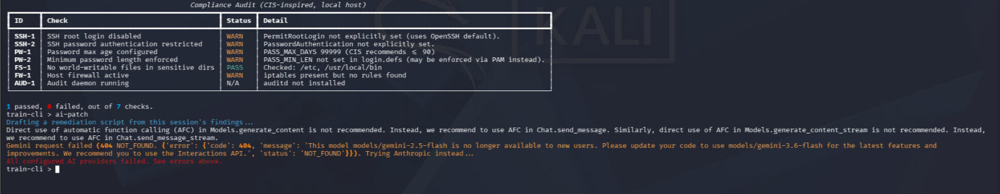
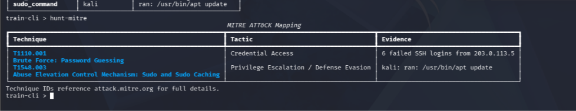
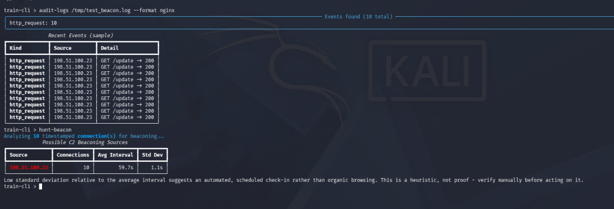
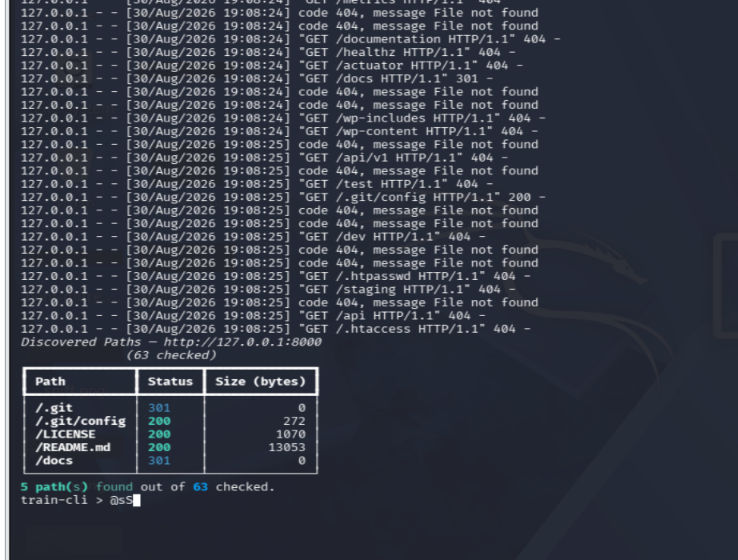
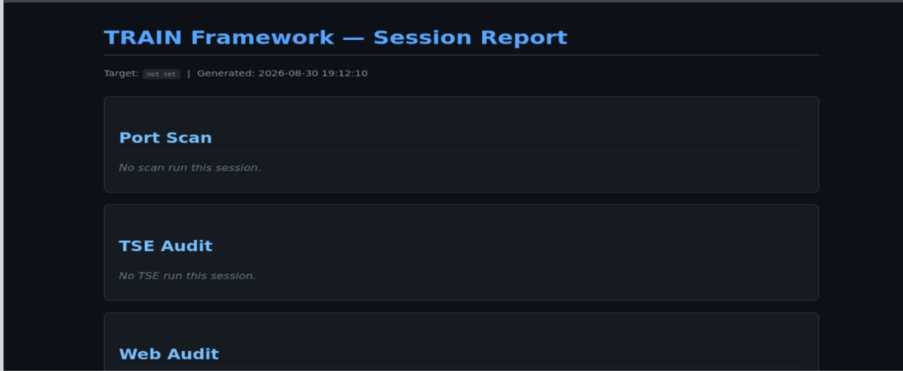
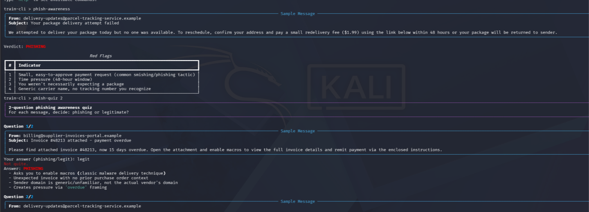

```
 _____ ____      _    ___ _   _
|_   _|  _ \    / \  |_ _| \ | |
  | | | |_) |  / _ \  | ||  \| |
  | | |  _ <  / ___ \ | || |\  |
  |_| |_| \_\/_/   \_\___|_| \_|

Threat Response & Automated Intelligence Network
        Purple Team CLI  |  v0.1.0-dev
```

# TRAIN Framework

**TRAIN** (Threat Response & Automated Intelligence Network) is a modular,
All-in-One **Purple Team** (Dual-Use: Red Team + Blue Team) cybersecurity
CLI tool combining Python, C++, and Go. It brings together network
recon, IDS/IPS, web auditing, CVE lookup, compliance checking, log
correlation, MITRE ATT&CK mapping, OSINT/geolocation, binary forensics, an
encrypted secrets vault, and phishing-awareness training — all inside a
single interactive terminal interface (TUI).



> ⚠️ **Ethical use only:** This tool is intended for use against your own
> systems, your own lab environment (VirtualBox/VMware lab), or systems
> you have explicit written authorization to test. Using it against
> systems without permission is illegal.

---

## 📋 Table of Contents

- [Features](#-features)
- [Architecture](#-architecture)
- [Installation](#-installation)
- [Command Reference](#-command-reference)
  - [Core commands](#core-commands)
  - [Network recon & IDS/IPS](#network-recon--idsips)
  - [Web auditing](#web-auditing)
  - [Vulnerability & compliance auditing](#vulnerability--compliance-auditing)
  - [Log analysis & threat hunting](#log-analysis--threat-hunting)
  - [OSINT & reputation](#osint--reputation)
  - [Binary forensics](#binary-forensics)
  - [Passwords & encryption](#passwords--encryption)
  - [Phishing awareness training](#phishing-awareness-training)
  - [Reporting](#reporting)
- [Screenshots](#-screenshots)
- [Project Structure](#-project-structure)
- [Contributing](#-contributing)

---

## ✨ Features

| Module | Language | What it does |
|---|---|---|
| `scanner.cpp` | C++ | Multi-threaded TCP port scanner + banner grabbing |
| `sniffer.go` | Go | libpcap-based, Snort-style IDS/IPS engine |
| `web_auditor.py` | Python | HTTP header/TLS/misconfig auditing + local forwarding proxy |
| `script_engine.py` | Python | TSE — FTP/SSH/HTTP/MySQL/PostgreSQL/MongoDB/Redis audit checks |
| `cve_lookup.py` | Python | NVD API CVE lookup + YAML template scanner |
| `compliance.py` | Python | CIS Benchmark-inspired local system compliance audit |
| `log_engine.py` | Python | SSH/nginx/PowerShell/LSASS log correlation |
| `threat_hunter.py` | Python | MITRE ATT&CK mapping + C2 beaconing detection |
| `osint_auditor.py` | Python | DNS enumeration, geolocation/ASN lookup, VirusTotal reputation |
| `api_tester.py` | Python | REST API testing and endpoint discovery |
| `binary_analyzer.py` | Python | Static PE/ELF forensics (headers, sections, entropy) |
| `pass_auditor.py` | Python | Password entropy + HaveIBeenPwned breach check |
| `vault_manager.py` | Python | AES-256 encrypted local secrets vault |
| `crypto_utils.py` | Python | Base64/Hex/URL encode-decode + hashing |
| `phish_awareness.py` | Python | Interactive phishing-recognition training with 44 examples across 4 difficulty levels |
| `dir_brute.py` | Python | Web directory/file discovery (gobuster/dirb-style) |
| `report_generator.py` | Python | Aggregates all session findings into a single HTML report |

---

## 🏗 Architecture

```
                    ┌─────────────────────┐
                    │   main.py (entry)     │
                    └──────────┬───────────┘
                               │
                    ┌──────────▼───────────┐
                    │  core/tui_engine.py   │  ← Rich/Prompt_Toolkit TUI
                    │  (command registry)    │
                    └──────────┬───────────┘
                               │
              ┌────────────────┼────────────────┐
              │                │                 │
    ┌─────────▼──────┐ ┌───────▼────────┐ ┌──────▼───────┐
    │  core/bridge.py │ │ modules/*.py    │ │ native_modules│
    │  (Python↔native)│ │ (13 Python      │ │ (C++ / Go)    │
    │                 │ │  modules)        │ │               │
    └─────────┬──────┘ └────────────────┘ └──────┬────────┘
              │                                    │
              └──────────── subprocess + JSON ──────┘
```

The Python TUI handles central orchestration; the C++ (`scanner.cpp`) and
Go (`sniffer.go`) modules are compiled as separate binaries and invoked
as subprocesses through `core/bridge.py`, with results returned as JSON.

---

## 🚀 Installation

### Requirements
- Linux (Kali / Ubuntu / Debian recommended) or WSL2
- Python 3.10+
- `g++` (with C++17 support)
- Go 1.20+
- `libpcap-dev`

### Steps

```bash
# 1. Clone the repo
git clone https://github.com/umidguluzada/train-framework.git
cd train-framework

# 2. Install system dependencies
sudo apt update
sudo apt install -y build-essential golang-go libpcap-dev redis-server

# 3. Install Python dependencies
pip install -r requirements.txt --break-system-packages

# 4. Compile the C++ port scanner
cd native_modules
g++ -std=c++17 -O2 -pthread scanner.cpp -o train_scanner

# 5. Compile the Go IDS/IPS engine
go mod init train_sniffer
go get github.com/google/gopacket
go build -o train_sniffer sniffer.go
cd ..

# 6. Run it
python3 main.py
```

> IDS/IPS (`sniff`/`ids-run`) requires root privileges to capture live
> packets: `sudo python3 main.py`.

> 💡 **Tip:** every command supports `<command> --help` (or `-h`) to show
> its own usage details, e.g. `scan --help`, `dir-brute --help`,
> `vault-add -h`.

---

## 📖 Command Reference

### Core commands

| Command | Description |
|---|---|
| `set target <IP/URL>` | Sets the target for the current session. Most other commands fall back to this value if no target is given directly. |
| `status` | Shows the current session state (target, verbose mode). |
| `help` | Lists all available commands. |
| `exit` / `quit` | Exits the program. |

### Network recon & IDS/IPS

| Command | Description |
|---|---|
| `scan [start] [end]` | Multi-threaded C++ port scanner. Shows open ports, a service guess, and a banner. E.g. `scan 1 1024`. |
| `sniff <iface> [rules] [--ips]` | Starts the Go IDS/IPS engine. Matches live packets against Snort-style rules in `rules.conf`. With `--ips`, blocks the matching source IP via `iptables`. E.g. `sniff eth0 native_modules/rules.conf`. |
| `ids-run` | Alias for `sniff`. |

### Web auditing

| Command | Description |
|---|---|
| `audit-web [url]` | Checks HTTP security headers (CSP, HSTS, X-Frame-Options, etc.), TLS certificate details, and well-known sensitive paths (`.git/config`, `.env`, `robots.txt`, etc.). |
| `web-proxy [port]` | Starts a lightweight local HTTP forwarding proxy (default port 8899). Logs every request/response passing through live. E.g. `curl -x http://127.0.0.1:8899 http://example.com`. |
| `api-test <url>` | Sends a GET+OPTIONS probe to a single API endpoint and shows status, allowed methods, and response structure. |
| `api-discover <base_url>` | Probes a set of common API path conventions (`/api`, `/health`, `/swagger.json`, etc.). |
| `dir-brute <url> [wordlist] [--threads N] [--ext ext1,ext2]` | Web directory/file discovery (gobuster/dirb-style). Sends plain GET requests to a wordlist of candidate paths and reports which respond with something other than 404. Uses a built-in wordlist if none is given. E.g. `dir-brute http://target.local --ext php,bak`. |

### Vulnerability & compliance auditing

| Command | Description |
|---|---|
| `run-tse [ports]` | TRAIN Scripting Engine — runs audit checks against the ports found by the last `scan` (or given manually): FTP anonymous login, SSH banner/algorithms, HTTP version disclosure, MySQL/PostgreSQL/MongoDB/Redis auth status. |
| `audit-cve <keywords>` | Searches the NVD (National Vulnerability Database) API for CVEs. `audit-cve --from-tse` auto-searches using banners from the last TSE run. |
| `template-scan <file.yaml>` | Runs simple HTTP-path checks defined in a local YAML template (a simplified, Nuclei-style scanner). |
| `audit-compliance` | Runs 7 CIS Benchmark-inspired checks on the local host: SSH root login, password policy, world-writable files, firewall status, audit daemon status. |

### Log analysis & threat hunting

| Command | Description |
|---|---|
| `audit-logs <file> --format <type>` | Parses a log file into structured events. Supported formats: `auth` (SSH/sudo), `syslog`, `nginx` (HTTP access log), `json-alerts` (sniffer.go output), `powershell` (Windows Event ID 4104), `lsass` (Windows Event ID 4656/4663). Automatically flags brute-force sources. |
| `hunt-mitre` | Maps findings gathered this session (compliance, TSE, logs, IDS) to real MITRE ATT&CK technique IDs (T1110, T1548, T1078, etc.). |
| `hunt-beacon` | Statistically analyzes timestamps from the last `audit-logs --format nginx` run to detect C2 "beaconing" (regular, automated check-in) patterns. |

### OSINT & reputation

| Command | Description |
|---|---|
| `audit-osint <domain>` | Passively enumerates a domain's DNS records (A, AAAA, MX, TXT, NS, CNAME, SOA). |
| `geo-track <ip/domain>` | Shows geolocation, ISP, and ASN for an IP/domain (via ip-api.com). |
| `check-vt <hash/IP>` | Looks up a file hash or IP's reputation via the VirusTotal v3 API (requires the `VT_API_KEY` environment variable). |

### Binary forensics

| Command | Description |
|---|---|
| `analyze-binary <file>` | Shows the headers, sections, entropy, and imported functions of a PE (Windows) or ELF (Linux) file — pure static analysis, no execution. |

### Passwords & encryption

| Command | Description |
|---|---|
| `audit-pass <password> [--offline]` | Calculates password entropy (bits) and checks it against HaveIBeenPwned's k-anonymity API for known breaches (`--offline` skips the network lookup). |
| `vault-init` | Creates a new AES-256 encrypted local secrets vault (prompts for a master password). |
| `vault-add <name>` | Adds a new value (password, API key, etc.) to the vault. |
| `vault-get <name>` | Decrypts and displays one value from the vault. |
| `vault-list` | Lists all entry names in the vault (without decrypting values). |
| `vault-remove <name>` | Removes an entry from the vault. |
| `encode <base64\|hex\|url> <text>` | Encodes text into the given format. |
| `decode <base64\|hex\|url> <text>` | Decodes encoded text. |
| `hash <md5\|sha1\|sha256\|sha512> <text>` | Computes the hash of a given text. |

### Phishing awareness training

| Command | Description |
|---|---|
| `phish-awareness [level]` | Shows a random sample phishing/legitimate email and explains its red flags. Level: `easy`, `medium`, `hard`, `critical` (default: any). |
| `phish-quiz [count] [level]` | Interactive quiz — for each message, asks "phishing or legit?" and scores you at the end. E.g. `phish-quiz 10 hard`, `phish-quiz all critical`. |

### Reporting

| Command | Description |
|---|---|
| `generate-report [output.html]` | Aggregates every finding gathered this session (port scan, TSE, web audit, dir-brute, compliance, CVE, logs, MITRE mapping, C2 beaconing) into a single self-contained HTML report. Default output: `train_report.html`. |

---

## 🖼 Screenshots

### `scan` — multi-threaded port scan with banner grabbing


### `sniff` — live IDS alert on an incoming SSH connection


### `audit-web` — HTTP security header + sensitive path audit


### `audit-compliance` — local CIS Benchmark-inspired checks


### `hunt-mitre` — findings mapped to MITRE ATT&CK techniques


### `hunt-beacon` — statistical C2 beaconing detection


### `dir-brute` — web directory/file discovery


### `generate-report` — full session findings exported as HTML


### `phish-quiz` — interactive phishing-awareness quiz


---

## 📁 Project Structure

```
train_framework/
├── main.py                      # Entry point
├── requirements.txt             # Python dependencies
├── README.md                    # This file
│
├── core/
│   ├── tui_engine.py            # TUI, banner, command registry
│   └── bridge.py                # Python ↔ C++/Go bridge
│
├── native_modules/
│   ├── scanner.cpp              # C++ port scanner
│   ├── sniffer.go               # Go IDS/IPS engine
│   └── rules.conf               # Snort-style signature rules
│
├── templates/
│   └── example-template.yaml    # Sample YAML audit template
│
├── docs/
│   └── screenshots/              # README screenshots
│
└── modules/
    ├── web_auditor.py
    ├── crypto_utils.py
    ├── pass_auditor.py
    ├── script_engine.py
    ├── cve_lookup.py
    ├── compliance.py
    ├── log_engine.py
    ├── threat_hunter.py
    ├── osint_auditor.py
    ├── api_tester.py
    ├── binary_analyzer.py
    ├── vault_manager.py
    ├── phish_awareness.py
    ├── dir_brute.py
    └── report_generator.py
```

---

## 🤝 Contributing

This is a personal project built for learning and portfolio purposes.
Issues and pull requests with suggestions or fixes are welcome.

## 📜 License

This project is licensed under the [MIT License](LICENSE) — see the
`LICENSE` file for details.
